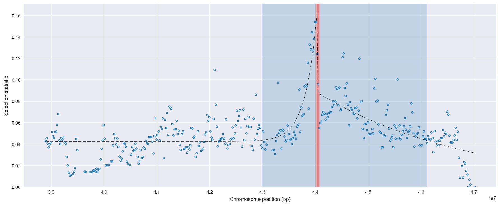
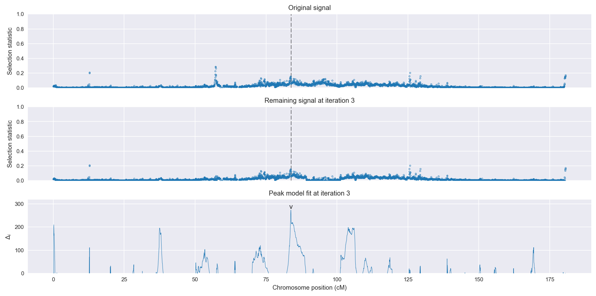
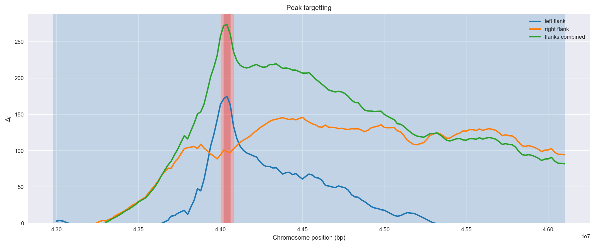
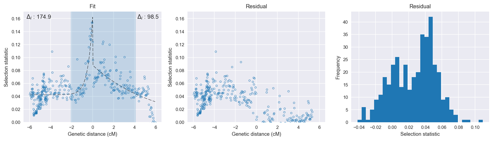

Uganda *An. gambiae* | H12 | Chromosome 3 | Signal #3
================================================================================

This page describes a signal of selection found in the
:doc:`/populations/ugs` population using the
:doc:`/methods/h12` statistic.
The inferred focus of this signal is on chromosome arm 3R from
position 44,000,001 to 44,080,000.

The following 10 genes overlap the focal region: :doc:`/genes/AGAP009830`,  :doc:`/genes/AGAP009831`,  :doc:`/genes/AGAP009832` (CASPS8 - short caspase 8),  :doc:`/genes/AGAP028572` (Gustatory receptor),  :doc:`/genes/AGAP009833` (voltage-dependent anion-selective channel protein 2),  :doc:`/genes/AGAP009834` (COP9 signalosome subunit 4),  :doc:`/genes/AGAP009835` (ABCC14 - ATP-binding cassette transporter (ABC transporter) family C member 14),  :doc:`/genes/AGAP009836`,  :doc:`/genes/AGAP009837`,  :doc:`/genes/AGAP009838` (Non-imprinted in Prader-Willi/Angelman syndrome region protein 2-like protein).

The following 10 genes are within 40 kbp of the focal
region: :doc:`/genes/AGAP009829` (beat protein),  :doc:`/genes/AGAP009839` (Phosphatase 1 regulatory subunit 7),  :doc:`/genes/AGAP009840` (USO1 vesicle docking protein homolog),  :doc:`/genes/AGAP009841`,  :doc:`/genes/AGAP009842` (ribonuclease T2),  :doc:`/genes/AGAP009843`,  :doc:`/genes/AGAP009844` (CLIPB15 - CLIP-domain serine protease),  :doc:`/genes/AGAP009845`,  :doc:`/genes/AGAP009846` (Ras-related protein Rab-9A),  :doc:`/genes/AGAP009847` (Outspread).

    **Figure 1**. Location of the signal of selection. Blue markers show the
    value of the selection statistic in non-overlapping 20 kbp windows. The
    dashed black line shows the fitted peak model. The vertical red bar shows
    the inferred focus of the selection signal. The shaded blue area shows the
    inferred genomic region affected by the selection event.

Related signals
---------------

Overlapping signals
~~~~~~~~~~~~~~~~~~~

The following selection signals have an inferred focus which overlaps with the
focus of this signal:

.. cssclass:: table-hover
.. csv-table::
    :widths: auto
    :header: Signal, Focus, Score

    

Adjacent signals
~~~~~~~~~~~~~~~~

The following selection signals have an inferred focus that is immediately
adjacent to the focus of this signal:

.. cssclass:: table-hover
.. csv-table::
    :header: Signal, Chromosome, Start, Stop, Score, Genes

    :doc:`/signals/h12/bfs/1/index`, 2L, "2,420,000", "2,460,000", 511.2, AGAP001234
    :doc:`/signals/h12/bfs/1/index`, 2L, "2,420,000", "2,460,000", 511.2, AGAP001234
    :doc:`/signals/h12/bfs/1/index`, 2L, "2,420,000", "2,460,000", 511.2, AGAP001234
    :doc:`/signals/h12/bfs/1/index`, 2L, "2,420,000", "2,460,000", 511.2, AGAP001234

Nearby signals
~~~~~~~~~~~~~~

The following signals affect a genome region that overlaps with the genome region
affected by this signal:

.. cssclass:: table-hover
.. csv-table::
    :header: Signal, Chromosome, Start, Stop, Score, Genes

    :doc:`/signals/h12/bfs/1/index`, 2L, "2,420,000", "2,460,000", 511.2, AGAP001234
    :doc:`/signals/h12/bfs/1/index`, 2L, "2,420,000", "2,460,000", 511.2, AGAP001234
    :doc:`/signals/h12/bfs/1/index`, 2L, "2,420,000", "2,460,000", 511.2, AGAP001234
    :doc:`/signals/h12/bfs/1/index`, 2L, "2,420,000", "2,460,000", 511.2, AGAP001234

Diagnostics
-----------

The information below provides some diagnostics from the
:doc:`/methods/peak_modelling` procedure.

    **Figure 2**. Chromosome-wide selection statistic and results from peak
    modelling. **a**, TODO. **b**, TODO.

    **Figure 3**. Diagnostics from targetting the selection signal to a focal
    region. TODO.

    **Figure 4**. Diagnostics from fitting a peak model to the selection signal.
    **a**, TODO. **b**, TODO. **c**, TODO.

Model fit reports
~~~~~~~~~~~~~~~~~

Left flank, peak model::

    [[Model]]
        Model(exponential)
    [[Fit Statistics]]
        # function evals   = 23
        # data points      = 239
        # variables        = 3
        chi-square         = 0.059
        reduced chi-square = 0.000
        Akaike info crit   = -1980.064
        Bayesian info crit = -1969.635
    [[Variables]]
        amplitude:   0.11962321 +/- 0.008676 (7.25%) (init= 0.5)
        decay:       0.44764744 +/- 0.050640 (11.31%) (init= 0.5)
        c:           0.04248816 +/- 0.001126 (2.65%) (init= 0.04)
        cap:         1 (fixed)
    [[Correlations]] (unreported correlations are <  0.100)
        C(amplitude, decay)          = -0.635 
        C(decay, c)                  = -0.307 

Right flank, peak model::

    [[Model]]
        Model(exponential)
    [[Fit Statistics]]
        # function evals   = 68
        # data points      = 148
        # variables        = 3
        chi-square         = 0.043
        reduced chi-square = 0.000
        Akaike info crit   = -1200.983
        Bayesian info crit = -1191.992
    [[Variables]]
        amplitude:   0.08822587 +/- 0        (0.00%) (init= 0.5)
        decay:       5.83844685 +/- 0        (0.00%) (init= 0.5)
        c:           1.4950e-09 +/- 0        (0.00%) (init= 0.04)
        cap:         1 (fixed)

Left flank, null model::

    [[Model]]
        Model(constant)
    [[Fit Statistics]]
        # function evals   = 9
        # data points      = 237
        # variables        = 1
        chi-square         = 0.116
        reduced chi-square = 0.000
        Akaike info crit   = -1805.176
        Bayesian info crit = -1801.708
    [[Variables]]
        c:   0.04740780 +/- 0.001437 (3.03%) (init= 0.04)

Right flank, null model::

    [[Model]]
        Model(constant)
    [[Fit Statistics]]
        # function evals   = 9
        # data points      = 147
        # variables        = 1
        chi-square         = 0.080
        reduced chi-square = 0.001
        Akaike info crit   = -1102.478
        Bayesian info crit = -1099.488
    [[Variables]]
        c:   0.05443903 +/- 0.001933 (3.55%) (init= 0.04)

Comments
--------

.. raw:: html

    

    
    <noscript>Please enable JavaScript to view the <a href="https://disqus.com/?ref_noscript">comments powered by Disqus.</a></noscript>
