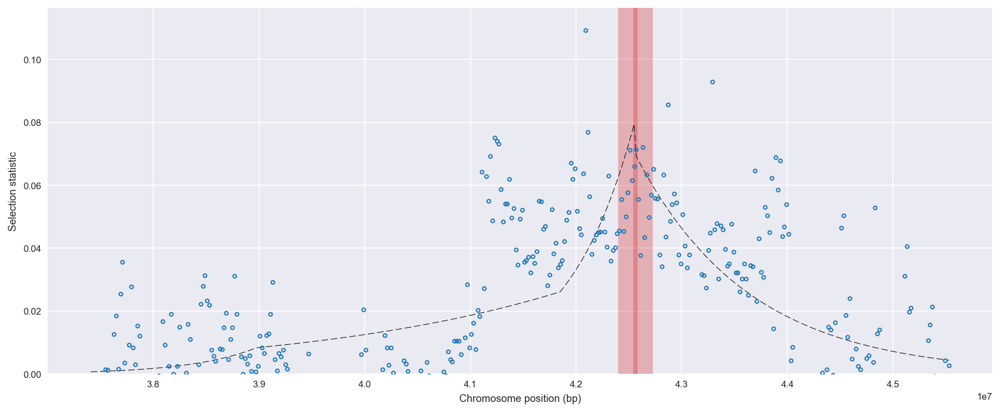
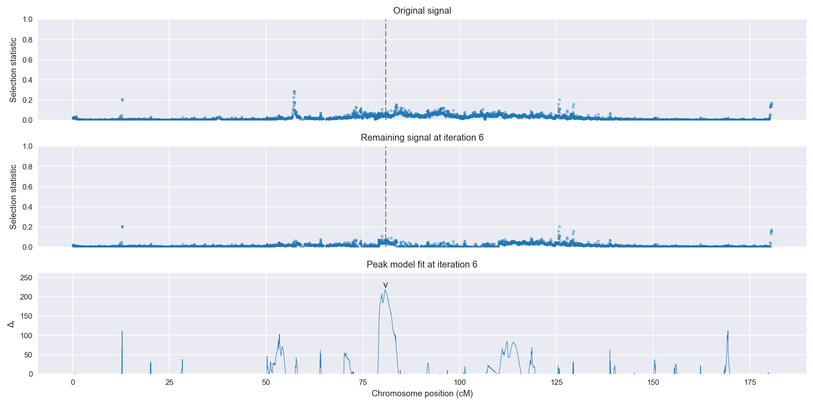
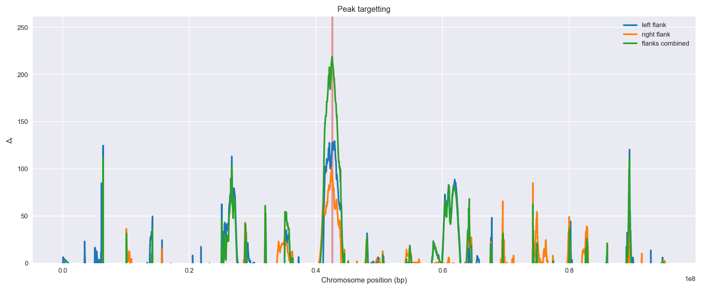
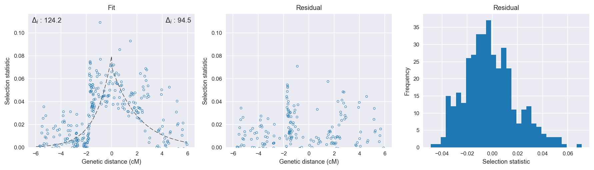

Uganda *An. gambiae* | H12 | Chromosome 3 | Signal #6
================================================================================

This page describes a signal of selection found in the
:doc:`/populations/ugs` population using the
:doc:`/methods/h12` statistic.
The inferred focus of this signal is on chromosome arm 3R from
position 42,400,001 to 42,720,000.

The following 13 genes overlap the focal region: :doc:`/genes/AGAP009757` (ANCE7 - angiotensin-converting enzyme 7),  :doc:`/genes/AGAP009758` (CPLCP11 - cuticular protein CPLCP11),  :doc:`/genes/AGAP009759` (CPLCP12 - cuticular protein CPLCP12),  :doc:`/genes/AGAP029049`,  :doc:`/genes/AGAP029054` (NimB2 - nimrod B2),  :doc:`/genes/AGAP029055`,  :doc:`/genes/AGAP009763`,  :doc:`/genes/AGAP009764`,  :doc:`/genes/AGAP009765` (dymeclin),  :doc:`/genes/AGAP009766`,  :doc:`/genes/AGAP009768` (solute carrier family 6 (neurotransmitter transporter, GABA) member 1),  :doc:`/genes/AGAP009769`,  :doc:`/genes/AGAP009770` (GPRCAL1 - putative calcitonin receptor 1).

The following 6 genes are within 40 kbp of the focal
region: :doc:`/genes/AGAP009751` (ANCE2 - angiotensin-converting enzyme 2),  :doc:`/genes/AGAP028646` (ANCE3 - angiotensin-converting enzyme 3),  :doc:`/genes/AGAP009754` (ANCE4 - angiotensin-converting enzyme 4),  :doc:`/genes/AGAP009755` (ANCE5 - angiotensin-converting enzyme 5),  :doc:`/genes/AGAP009756` (ANCE6 - angiotensin-converting enzyme 6),  :doc:`/genes/AGAP027993` (CPLCP10 - cuticular protein (putative) CPLCP10).

    **Figure 1**. Location of the signal of selection. Blue markers show the
    value of the selection statistic in non-overlapping 20 kbp windows. The
    dashed black line shows the fitted peak model. The vertical red bar shows
    the inferred focus of the selection signal. The shaded blue area shows the
    inferred genomic region affected by the selection event.

Related signals
---------------

Overlapping signals
~~~~~~~~~~~~~~~~~~~

The following selection signals have an inferred focus which overlaps with the
focus of this signal:

.. cssclass:: table-hover
.. csv-table::
    :widths: auto
    :header: Signal, Focus, Score

    

Adjacent signals
~~~~~~~~~~~~~~~~

The following selection signals have an inferred focus that is immediately
adjacent to the focus of this signal:

.. cssclass:: table-hover
.. csv-table::
    :header: Signal, Chromosome, Start, Stop, Score, Genes

    :doc:`/signals/h12/bfs/1/index`, 2L, "2,420,000", "2,460,000", 511.2, AGAP001234
    :doc:`/signals/h12/bfs/1/index`, 2L, "2,420,000", "2,460,000", 511.2, AGAP001234
    :doc:`/signals/h12/bfs/1/index`, 2L, "2,420,000", "2,460,000", 511.2, AGAP001234
    :doc:`/signals/h12/bfs/1/index`, 2L, "2,420,000", "2,460,000", 511.2, AGAP001234

Nearby signals
~~~~~~~~~~~~~~

The following signals affect a genome region that overlaps with the genome region
affected by this signal:

.. cssclass:: table-hover
.. csv-table::
    :header: Signal, Chromosome, Start, Stop, Score, Genes

    :doc:`/signals/h12/bfs/1/index`, 2L, "2,420,000", "2,460,000", 511.2, AGAP001234
    :doc:`/signals/h12/bfs/1/index`, 2L, "2,420,000", "2,460,000", 511.2, AGAP001234
    :doc:`/signals/h12/bfs/1/index`, 2L, "2,420,000", "2,460,000", 511.2, AGAP001234
    :doc:`/signals/h12/bfs/1/index`, 2L, "2,420,000", "2,460,000", 511.2, AGAP001234

Diagnostics
-----------

The information below provides some diagnostics from the
:doc:`/methods/peak_modelling` procedure.

    **Figure 2**. Chromosome-wide selection statistic and results from peak
    modelling. **a**, TODO. **b**, TODO.

    **Figure 3**. Diagnostics from targetting the selection signal to a focal
    region. TODO.

    **Figure 4**. Diagnostics from fitting a peak model to the selection signal.
    **a**, TODO. **b**, TODO. **c**, TODO.

Model fit reports
~~~~~~~~~~~~~~~~~

Left flank, peak model::

    [[Model]]
        Model(exponential)
    [[Fit Statistics]]
        # function evals   = 56
        # data points      = 244
        # variables        = 3
        chi-square         = 0.103
        reduced chi-square = 0.000
        Akaike info crit   = -1889.192
        Bayesian info crit = -1878.701
    [[Variables]]
        amplitude:   0.07946711 +/- 0        (0.00%) (init= 0.5)
        decay:       1.25765915 +/- 0        (0.00%) (init= 0.5)
        c:           1.3014e-09 +/- 0        (0.00%) (init= 0.04)
        cap:         1 (fixed)

Right flank, peak model::

    [[Model]]
        Model(exponential)
    [[Fit Statistics]]
        # function evals   = 68
        # data points      = 144
        # variables        = 3
        chi-square         = 0.057
        reduced chi-square = 0.000
        Akaike info crit   = -1122.074
        Bayesian info crit = -1113.164
    [[Variables]]
        amplitude:   0.07050373 +/- 0        (0.00%) (init= 0.5)
        decay:       2.14159014 +/- 0        (0.00%) (init= 0.5)
        c:           1.0587e-11 +/- 0        (0.00%) (init= 0.04)
        cap:         1 (fixed)

Left flank, null model::

    [[Model]]
        Model(constant)
    [[Fit Statistics]]
        # function evals   = 11
        # data points      = 243
        # variables        = 1
        chi-square         = 0.169
        reduced chi-square = 0.001
        Akaike info crit   = -1764.995
        Bayesian info crit = -1761.502
    [[Variables]]
        c:   0.01462768 +/- 0.001694 (11.59%) (init= 0.04)

Right flank, null model::

    [[Model]]
        Model(constant)
    [[Fit Statistics]]
        # function evals   = 11
        # data points      = 143
        # variables        = 1
        chi-square         = 0.107
        reduced chi-square = 0.001
        Akaike info crit   = -1027.525
        Bayesian info crit = -1024.562
    [[Variables]]
        c:   0.02103074 +/- 0.002293 (10.91%) (init= 0.04)

Comments
--------

.. raw:: html

    

    
    <noscript>Please enable JavaScript to view the <a href="https://disqus.com/?ref_noscript">comments powered by Disqus.</a></noscript>
