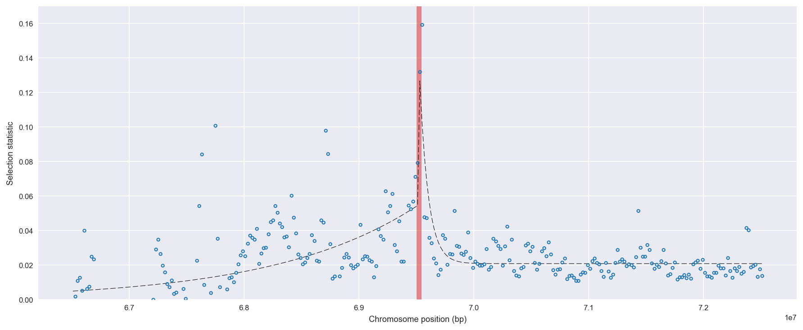
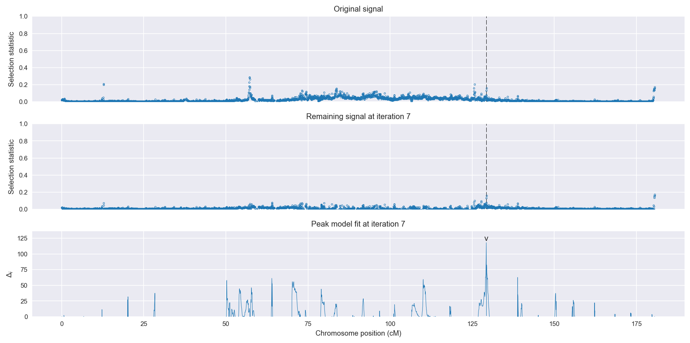
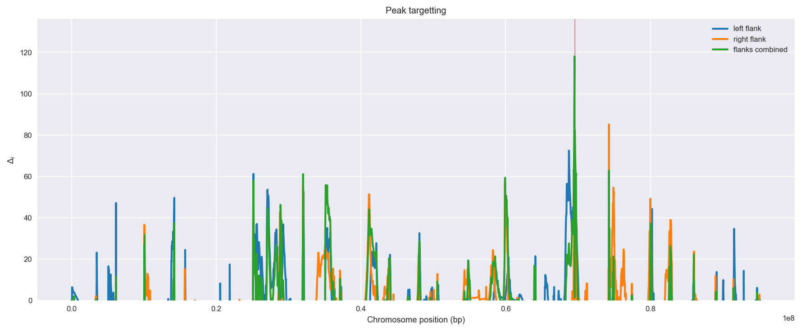
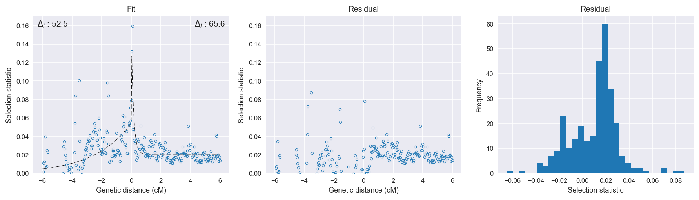

Uganda *An. gambiae* | H12 | Chromosome 3 | Signal #7
================================================================================

This page describes a signal of selection found in the
:doc:`/populations/ugs` population using the
:doc:`/methods/h12` statistic.
The inferred focus of this signal is on chromosome arm 3L from
position 16,300,001 to 16,340,000.

The following 9 genes overlap the focal region: :doc:`/genes/AGAP028689`,  :doc:`/genes/AGAP028690`,  :doc:`/genes/AGAP011076` (ubiquitin-conjugating enzyme E2 I),  :doc:`/genes/AGAP011077` (RpS12 - 40S ribosomal protein S12),  :doc:`/genes/AGAP011078` (zinc finger MYND domain-containing protein 10),  :doc:`/genes/AGAP011079`,  :doc:`/genes/AGAP011080` (hydroxymethylbilane synthase),  :doc:`/genes/AGAP011081` (Protein anon-73B1),  :doc:`/genes/AGAP011082` (heat shock transcription factor, invertebrate).

The following 18 genes are within 40 kbp of the focal
region: :doc:`/genes/AGAP011070`,  :doc:`/genes/AGAP011071`,  :doc:`/genes/AGAP028506`,  :doc:`/genes/AGAP011072`,  :doc:`/genes/AGAP028507`,  :doc:`/genes/AGAP011073`,  :doc:`/genes/AGAP028508`,  :doc:`/genes/AGAP028509`,  :doc:`/genes/AGAP011074`,  :doc:`/genes/AGAP028686`,  :doc:`/genes/AGAP028685`,  :doc:`/genes/AGAP028687`,  :doc:`/genes/AGAP028688`,  :doc:`/genes/AGAP011083`,  :doc:`/genes/AGAP011084` (ATP-dependent RNA helicase DDX27),  :doc:`/genes/AGAP011085`,  :doc:`/genes/AGAP011086`,  :doc:`/genes/AGAP028510`.

    **Figure 1**. Location of the signal of selection. Blue markers show the
    value of the selection statistic in non-overlapping 20 kbp windows. The
    dashed black line shows the fitted peak model. The vertical red bar shows
    the inferred focus of the selection signal. The shaded blue area shows the
    inferred genomic region affected by the selection event.

Related signals
---------------

Overlapping signals
~~~~~~~~~~~~~~~~~~~

The following selection signals have an inferred focus which overlaps with the
focus of this signal:

.. cssclass:: table-hover
.. csv-table::
    :widths: auto
    :header: Signal, Focus, Score

    

Adjacent signals
~~~~~~~~~~~~~~~~

The following selection signals have an inferred focus that is immediately
adjacent to the focus of this signal:

.. cssclass:: table-hover
.. csv-table::
    :header: Signal, Chromosome, Start, Stop, Score, Genes

    :doc:`/signals/h12/bfs/1/index`, 2L, "2,420,000", "2,460,000", 511.2, AGAP001234
    :doc:`/signals/h12/bfs/1/index`, 2L, "2,420,000", "2,460,000", 511.2, AGAP001234
    :doc:`/signals/h12/bfs/1/index`, 2L, "2,420,000", "2,460,000", 511.2, AGAP001234
    :doc:`/signals/h12/bfs/1/index`, 2L, "2,420,000", "2,460,000", 511.2, AGAP001234

Nearby signals
~~~~~~~~~~~~~~

The following signals affect a genome region that overlaps with the genome region
affected by this signal:

.. cssclass:: table-hover
.. csv-table::
    :header: Signal, Chromosome, Start, Stop, Score, Genes

    :doc:`/signals/h12/bfs/1/index`, 2L, "2,420,000", "2,460,000", 511.2, AGAP001234
    :doc:`/signals/h12/bfs/1/index`, 2L, "2,420,000", "2,460,000", 511.2, AGAP001234
    :doc:`/signals/h12/bfs/1/index`, 2L, "2,420,000", "2,460,000", 511.2, AGAP001234
    :doc:`/signals/h12/bfs/1/index`, 2L, "2,420,000", "2,460,000", 511.2, AGAP001234

Diagnostics
-----------

The information below provides some diagnostics from the
:doc:`/methods/peak_modelling` procedure.

    **Figure 2**. Chromosome-wide selection statistic and results from peak
    modelling. **a**, TODO. **b**, TODO.

    **Figure 3**. Diagnostics from targetting the selection signal to a focal
    region. TODO.

    **Figure 4**. Diagnostics from fitting a peak model to the selection signal.
    **a**, TODO. **b**, TODO. **c**, TODO.

Model fit reports
~~~~~~~~~~~~~~~~~

Left flank, peak model::

    [[Model]]
        Model(exponential)
    [[Fit Statistics]]
        # function evals   = 125
        # data points      = 148
        # variables        = 3
        chi-square         = 0.072
        reduced chi-square = 0.000
        Akaike info crit   = -1123.951
        Bayesian info crit = -1114.959
    [[Variables]]
        amplitude:   0.05440425 +/- 0        (0.00%) (init= 0.5)
        decay:       2.48851648 +/- 0        (0.00%) (init= 0.5)
        c:           3.5749e-10 +/- 0        (0.00%) (init= 0.04)
        cap:         1 (fixed)

Right flank, peak model::

    [[Model]]
        Model(exponential)
    [[Fit Statistics]]
        # function evals   = 37
        # data points      = 150
        # variables        = 3
        chi-square         = 0.015
        reduced chi-square = 0.000
        Akaike info crit   = -1376.536
        Bayesian info crit = -1367.504
    [[Variables]]
        amplitude:   0.13823044 +/- 0        (0.00%) (init= 0.5)
        decay:       0.15000000 +/- 0        (0.00%) (init= 0.5)
        c:           0.02078384 +/- 0        (0.00%) (init= 0.04)
        cap:         1 (fixed)

Left flank, null model::

    [[Model]]
        Model(constant)
    [[Fit Statistics]]
        # function evals   = 11
        # data points      = 147
        # variables        = 1
        chi-square         = 0.099
        reduced chi-square = 0.001
        Akaike info crit   = -1071.482
        Bayesian info crit = -1068.492
    [[Variables]]
        c:   0.01873806 +/- 0.002148 (11.46%) (init= 0.04)

Right flank, null model::

    [[Model]]
        Model(constant)
    [[Fit Statistics]]
        # function evals   = 11
        # data points      = 149
        # variables        = 1
        chi-square         = 0.022
        reduced chi-square = 0.000
        Akaike info crit   = -1310.940
        Bayesian info crit = -1307.936
    [[Variables]]
        c:   0.02289053 +/- 0.001003 (4.38%) (init= 0.04)

Comments
--------

.. raw:: html

    

    
    <noscript>Please enable JavaScript to view the <a href="https://disqus.com/?ref_noscript">comments powered by Disqus.</a></noscript>
